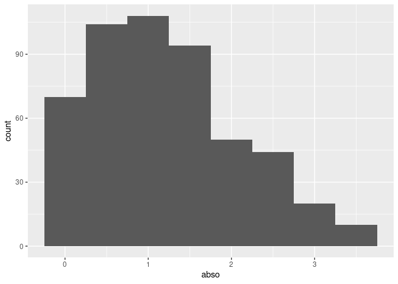

Simple document
================
Wayne
1872-06-05

I began by loading the `tidyverse` package.

I’m an R Markdown document!

# Section 1

Here’s a **code chunk** that samples from a *normal distribution*:

``` r
samp = rnorm(100)
length(samp)
```

    ## [1] 100

# Section 2

I can take the mean of the sample, too! The mean is -0.0079955.

# Section 3

``` r
df = tibble(
  rs = rnorm(500, mean = 1)
  , logi = rs > 0
  , abso = abs(rs)
)

ggplot(df, aes(x = abso)) + geom_histogram(binwidth = 0.5)
```

<!-- -->

Create a buleted list with the mean, median, and sd of the sample.

- -0.0079955
- 0.0020594
- 0.9985761

``` r
# apparently R sucked before R Markdown, which I absolutely believe
```
